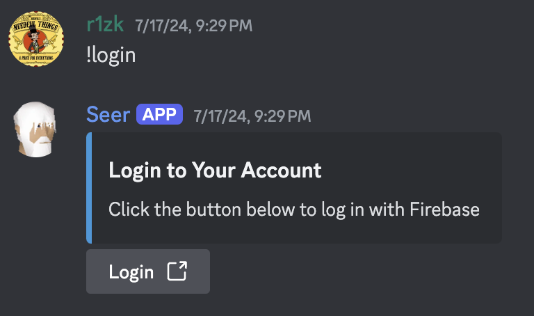
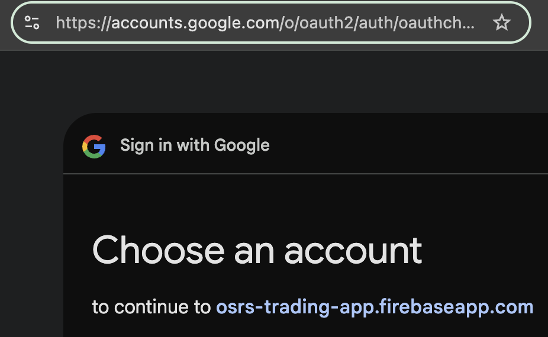
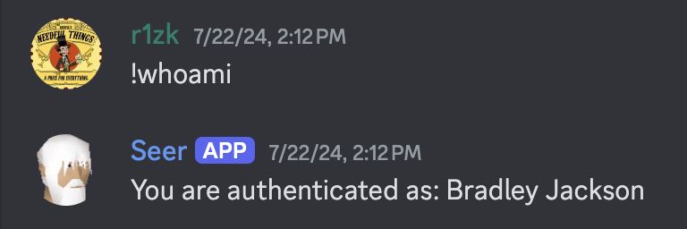
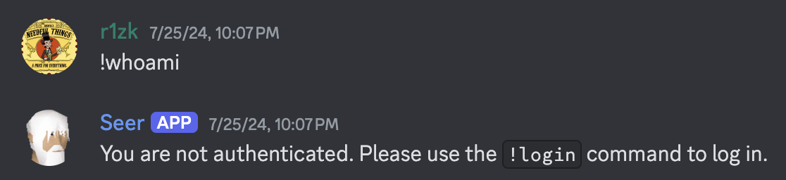

# Discord Bot with Firebase SSO

This project is a Discord bot that not only offers fun and engaging commands (from trivia games and stock simulations to RuneScape stats lookups) but also integrates **Firebase Single Sign-On (SSO)** for secure user authentication—allowing users (including GitHub users) to authenticate via Firebase.

Here is an example of logging in:

**Initial Login**  
  
  

**Testing Auth**  
  

**Auth Expired:**
  

---

## Features

- **Interactive Discord Commands:**  
  - **Trivia:** Play trivia games with questions fetched from Google Cloud Storage, complete with leaderboards and error handling.  
  - **Player Stats:** Retrieve RuneScape hiscores and display detailed statistics.  
  - **Stock Simulation:** Generate simulated stock price charts, calculate RSI, and display stats using dynamic embeds.  
  - **UI Components:** Utilize interactive buttons, dropdowns, and paginated embeds for a rich user experience.

- **Firebase SSO Integration:**  
  - Uses Firebase authentication (configured in `index.html` and `firebase.json`) to securely authenticate users via Google (or GitHub SSO, if configured) and redirect them back to the bot’s authentication callback.

- **Cloud Deployment:**  
  - Automated deployment using **Cloud Build** (`cloudbuild.yaml`) to build and deploy the bot to Google Cloud Run.  
  - **Policy configuration** (`policy.yaml`) ensures proper access management.

- **Modular Codebase:**  
  - Organized into separate modules for trivia logic (`bot.py`), fun player stats (`fun_player.py`), stock utilities (`stonks_utils.py`), and reusable UI components (`ui_components.py`).

- **Web Interface for Auth:**  
  - A simple hosted web app (using `index.html` and `404.html`) for managing the Firebase SSO flow.

---

## Getting Started

### Prerequisites

- Python 3.8+  
- Node.js (for Firebase CLI and hosting)  
- Google Cloud SDK (for Cloud Build and Cloud Run deployment)  
- Firebase project setup with Authentication enabled

### Installation

1. **Clone the Repository:**

   ```bash
   git clone <repository-url>
   cd discord-bot
   ```

2. **Install Python Dependencies:**

   ```bash
   pip install -r requirements.txt
   ```

3. **Configure Environment Variables:**

   Create a `.env` file or set the following variables:
   - `DISCORD_BOT_TOKEN` – Your Discord bot token.
   - Firebase and Google Cloud credentials as needed.

4. **Firebase Setup:**

   Ensure your Firebase project is configured for authentication. The provided `index.html` uses Firebase with a GoogleAuthProvider for SSO; modify it if you wish to integrate GitHub SSO.

### Running Locally

- **Start the Bot:**

  ```bash
  python bot.py
  ```

- **Run the Flask Health Endpoint:**

  The bot also runs a Flask server (on port 8080) for health checks. This is useful for deployment environments like Cloud Run.

### Deployment

1. **Cloud Build:**  
   Use the provided `cloudbuild.yaml` file to build and push your Docker image, then deploy to Cloud Run.

   ```bash
   gcloud builds submit --config=cloudbuild.yaml .
   ```

2. **Firebase Hosting:**  
   Deploy the authentication web app using Firebase Hosting:

   ```bash
   firebase deploy --only hosting
   ```

3. **Policy:**  
   The `policy.yaml` file ensures that the Cloud Run service is publicly accessible (adjust as needed for your security requirements).

---

## Firebase SSO

The authentication flow leverages Firebase's authentication system to allow users (including those authenticated via GitHub if configured) to sign in. The hosted `index.html` handles sign-in with Firebase (using the GoogleAuthProvider by default) and then redirects back to the bot's authentication callback URL on Cloud Run.

---

## Contributing

Contributions are welcome! Please open an issue or submit a pull request if you have suggestions or improvements.

---

## License

This project is open-source and available under the [MIT License](./LICENSE).

---

## Contact

For any questions or support, please contact [me@brad-jackson.com](mailto:me@brad-jackson.com).

Enjoy. Also you will need to change the callback url in [discord-sso/public/index.html](./discord-sso/public/index.html) (I left my link with query params as an example), and change [.firebaserc](./firebaserc) to your gcp project.